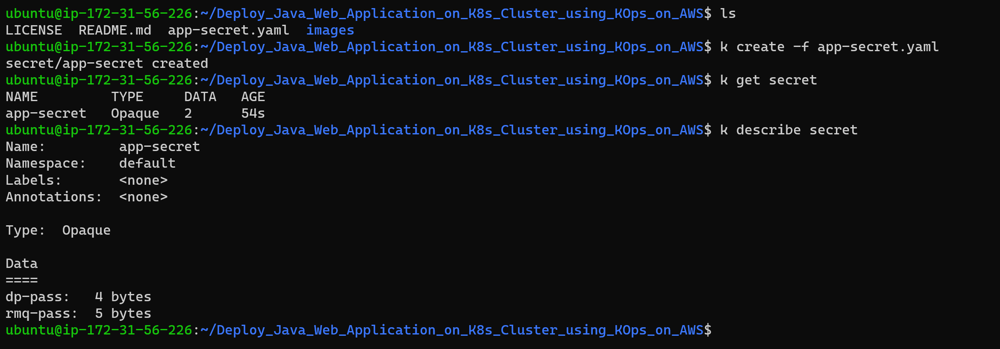

# Deploy Java Web Application on K8s Cluster using KOps on AWS.

Prerequites

AWSCLI
## Spin up KOps Cluster

Create cluster

```bash
kops create cluster --name=kube.oayanda.com --state=s3://oayanda-kops-state --zones=us-east-1a,us-east-1b --node-count=2 --node-size=t3.small --master-size=t3.medium --dns-zone=kube.oayanda.com
```


Update cluster

```bash
 kops update cluster --name kube.oayanda.com --state=s3://oayanda-kops-state --yes --admin
```


Validate cluster

```bash
kops validate cluster  --state=s3://oayanda-kops-state
```


Create Persistent Volume for DB Node and copy the volume ID for later use. *vol-023c6c76a8a8b98ce* and the AZ *us-east-1a*.

```bash
aws ec2 create-volume --availability-zone=us-east-1a --size=5 --volume-type=gp2 --tag-specifications 'ResourceType=volume,Tags=[{Key=KubernetesCluster,Value=kube.oayanda.com}]'
```

> ***Note:** For volume mapping, make sure the value of the tag is the same as your k8scluster.*


Verfiy from AWS console


Verify the node in us-east-1a

```bash

# Get available Nodes
k get nodes

# Get more details about a node using the name
k describe node <name>
```


Create custome labels for nodes

```bash
# Create label for node
k label nodes i-033bf8399b48c258e zone=us-east-1a

# Verify label creation
k get node i-033bf8399b48c258e --show-labels
```


## Writing definition Files

View Docker images for application here oayanda/vprofileapp:v1
oayanda/vprofiledb:v1

***Secret definition File***

Encode for the application and rabbitmg passwords with base64.

```bash
echo -n "<password>" | base64
```


Create Secret and deploy object

```bash
# create secret object
k create -f app-secret.yaml

# Show secret
k get secret
```

> ***Note** for production, the secret definition file should not be public because it might be decoded*.



***Database definition File***

```bash
apiVersion: apps/v1
kind: Deployment
metadata:
  name: vprodb
  labels:
    app: vprodb
spec:
  selector:
    matchLabels:
      app: vprodb
  replicas: 1
  template:
    metadata:
      labels:
        app: vprodb
    spec:
      containers:
        - name: vprodb
          image: oayanda/vprofiledb:v1
          args:
            - "--ignore-db-dir=lost+found"
          volumeMounts:
            - mountPath: /var/lib/mysql
              name: vpro-db-data
          ports:
            - name: vprodb-port
              containerPort: 3306
          env:
            - name: MYSQL_ROOT_PASSWORD
              valueFrom:
                secretKeyRef:
                  name: app-secret
                  key: db-pass
      nodeSelector:
        zone: us-east-1a
      volumes:
        - name: vpro-db-data
          awsElasticBlockStore:
            volumeID: vol-023c6c76a8a8b98ce
            fsType: ext4
```

Create DB deployment

```bash
k create -f vprodbdep.yaml
k get pod 
```


Verify volume is attached to pod

```bash
k describe pod pod vprodb-58b465f7f-zfth7
```


***DB Service Definition***

This will only be exposed internally to application and not to the public.

Create definition file *db-cip.yaml*

```bash
apiVersion: v1
kind: Service
metadata:
  name: vprodb 
spec:
  ports:
    - port: 3306
      targetPort: vprodb-port
      protocol: TCP
  selector:
    app: vprodb
  type: ClusterI
```

***Memcached deployment Definition***

This will use the offical docker image from docker hub.

Create definition file *mcdep.yaml*

```bash
apiVersion: apps/v1
kind: Deployment
metadata:
  name: vpromc
  labels:
    app: vpromc
spec:
  selector:
    matchLabels:
      app: vpromc
  replicas: 1
  template:
    metadata:
      labels:
        app: vpromc
    spec:
      containers:
        - name: vpromc
          image: memcached
          ports:
            - name: vpromc-port
              containerPort: 11211

```

***Memcached Service Definition***

This will only be exposed internally to application and not to the public.

Create definition file *mc-cip.yaml*

```bash
apiVersion: v1
kind: Service
metadata:
  name: vprocache01
spec:
  ports:
    - port: 11211
      targetPort: vpromc-port
      protocol: TCP
  selector:
    app: vpromc
  type: ClusterIP
```